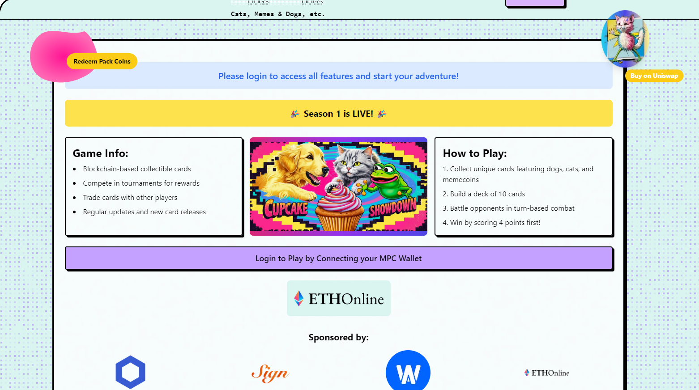

 

<p align="center">
  
  <h1 align="center"><b>Cats, Dogs, Memes, etc: Solidity Protocol</b></h1>
<p align="center">
    <br />
    <br />
    <a href="#whats-included"><strong>What's included</strong></a> ·
    <a href="#prerequisites"><strong>Prerequisites</strong></a> ·
    <a href="#getting-started"><strong>Getting Started</strong></a> ·
  </p>
</p>

A protocol that combines Chainlink's direct funded VRF 2.5, automation v2.1 and CCIP in a Proof-of-Concept of omnichain gaming around tokenised, multi-chain, 'Avatar Based Accounts'. Avatar Based Accounts provide gated access at L2 (in this case we used optimism sepolia) to games deployed at L1s (in this case mainnet sepolia). 

This allows: 
- omnichain agents to be integrated with games building on mainnet services (such as chainlink VRF, stackr mirco rollups, etc). 
- multi-chain tokenised access to web3 games
- simplify the development of omnichain games by abstracting chain-interactions away from dApp to user accounts.  

## What's included

### Deployed @L1 mainnet sepolia: 

[Chainlink direct funded VRF v2.5](https://docs.chain.link/vrf/v2-5/overview/direct-funding) - randomisation of cards in card packs. <br>
[Chainlink Automation v2.1](https://docs.chain.link/chainlink-automation) - Automated ending of tournaments. <br>
[OpenZeppelin's ERC20](https://docs.openzeppelin.com/contracts/4.x/erc20) - Game meme coin.  <br>
[OpenZeppelin's ERC1155](https://docs.openzeppelin.com/contracts/4.x/erc1155) - cards and card distribution.<br>

### Deployed @L1 mainnet sepolia and @L2 optimism sepolia: 

[Chainlink CCIP](https://docs.chain.link/ccip) - Multichain ERC-6551 players. <br>
[Tokenbound's ERC-6551](https://docs.tokenbound.org/guides/deploy-account-implementation) - ERC-6551 'Avatar Based Accounts'.  <br>
[OpenZeppelin's ERC721](https://docs.openzeppelin.com/contracts/4.x/erc721) - Avatar NFT as basis for ERC-6551 'Avatar Based Accounts'. <br>

## Directory Structure

```
.
├── lib                                 # Installed dependencies. 
│    ├── ccip-starter-kit-foundry       # Supabase (API, Auth, Storage, Realtime, Edge Functions)
│    ├── chainlink                      # App - Cats, Dogs, Memes. etc UI
│    ├── chainlink-local                # Marketing site or Landing Page
│    └── ...
|
├── script                              # Deployment scripts
│    ├── DeployGames.s.sol              # Deploys Games.sol, Cards.sol, Coins.sol also uploads a test set of cards. 
│    ├── DeployPlayers.s.sol            # Deploys Players.sol and AvatarBasedAccounts.sol 
│    └── HelperConfig.s.sol        
|
├── src                                 # Protocol resources
│    ├── lib                            # Address of deployed contracts on L1 and L2. 
│    ├── metadata                       # Metadata of cards. 
│    ├── AvatarBasedAccount.sol         # ERC-6551 omni-chain token based account. Uses Chainlink's CCIP. 
│    ├── Cards.sol                      # ERC-1155 cards manager. Uses Chainlink's direct funded VRF 2.5.
│    ├── Coins.sol                      # ERC-20 memecoin minter and distributer. 
│    ├── Games.sol                      # Manages games and tournaments. Uses Chainlink automation. 
│    └── Players.sol                    # Creates ERC-6551 Avatar based accounts. Uses Chainlink's CCIP. 
|
├── test                                # Tests 
│    ├── fuzz                           # Fuzz tests
│         └── Games_fuzz.t.sol          # Fuzz test of games, card dispenser and tournament logic. 
│    ├── resources                      # Card metadata used in tests.  
│    └── unit                           # Unit tests
│         ├── AvatarBasedAccount.t.sol  
│         ├── Cards.t.sol               
│         ├── ChainlinkCCIP.t.sol       # Local test of Chainlink CCIP. Uses ccip-starter-kit-foundry. 
│         ├── ChainlinkVRF.t.sol        # Local test of chainlink VRF. 
│         └── ...               
|        
├── .env.example                   
├── foundry.toml                   
├── LICENSE
├── README.md
├── Makefile.md                         # Commands to deploy contracts on mainnet sepolia and optimism sepolia.  
├── remappings.txt
└── ...


```

## Prerequisites

Foundry<br>
Docker<br>

## Getting Started

1. Clone this repo locally and move to the solidity folder:

```sh
git clone https://github.com/tcxcx/cats_dogs_memes95
cd cats_dogs_memes95/packages/solidity 
```

2. Copy `.env.example` to `.env` and update the variables.

```sh
cp env.example .env
```

3. run make. This will install all dependencies and run the tests. 

```sh
make
```

4. Run the tests without installing packages: 

```sh
forge test 
```

## Checkout the deployments:

[Cards.sol]() 0x237832... <br>
[Games.sol]() 0x237832... <br>
[Coins.sol]() 0x237832... <br>
[Players.sol L1]() 0x237832... <br>
[Players.sol L2]() 0x237832... <br>
[AvatarBasedAccount.sol L1]() 0x237832... <br>
[AvatarBasedAccount.sol L2]()  0x237832... <br>

## Checkout proofs of state change:

[Chainlink VRF]() Random selection of cards in card pack. <br>
[Chainlink Automation]() Automated ending of tournaments. <br>
[Chainlink CCIP L2]() Creation player optimism sepolia. <br>
[Chainlink CCIP L1]() Creation mirror player at mainnet sepolia. <br>
