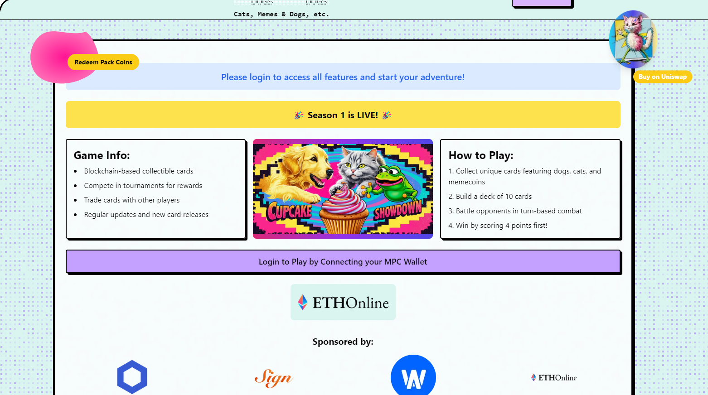

# Live long and build! 🖖🏼🏼

<p align="center">
	<h1 align="center"><b>Cats, Dogs, Memes, etc. v1</b></h1>
<p align="center">
    <br />
    <br />
    <a href="#whats-included"><strong>What's included</strong></a> ·
    <a href="#prerequisites"><strong>Prerequisites</strong></a> ·
    <a href="#getting-started"><strong>Getting Started</strong></a> ·
  </p>
</p>

The latest on Next.js framework on a monorepo ready for edge, supabase and expo app development with a focus on code reuse and best practices for edge server computing.

## What's included

[Next.js](https://nextjs.org/) - Framework<br>
[Web3Auth MPC](https://web3auth.io/) - Custom Wallet Framework<br>
[Liveblocks](https://liveblocks.io/) - Real-time Framework<br>
[Turborepo](https://turbo.build) - Build system<br>
[Biome](https://biomejs.dev) - Linter, formatter<br>
[TailwindCSS](https://tailwindcss.com/) - Styling<br>
[Shadcn](https://ui.shadcn.com/) - UI components<br>
[TypeScript](https://www.typescriptlang.org/) - Type safety<br>
[Supabase](https://supabase.com/) - Authentication, database, storage<br>
[Upstash](https://upstash.com/) - Cache and rate limiting<br>
[React Email](https://react.email/) - Email templates<br>
[Resend](https://resend.com/) - Email delivery<br>
[i18n](https://next-international.vercel.app/) - Internationalization<br>
[Dub](https://dub.sh/) - Sharable links<br>
[Trigger.dev](https://trigger.dev/) - Background jobs<br>
[OpenPanel](https://openpanel.dev/) - Analytics<br>
[react-safe-action](https://next-safe-action.dev) - Validated Server Actions<br>
[nuqs](https://nuqs.47ng.com/) - Type-safe search params state manager<br>
[next-themes](https://next-themes-example.vercel.app/) - Theme manager<br>

## Directory Structure

```
.
├── apps                         # App workspace
│    ├── api                     # Supabase (API, Auth, Storage, Realtime, Edge Functions)
│    ├── app                     # App - Cats, Dogs, Memes. etc UI
│    ├── web                     # Marketing site or Landing Page
│    └── ...
├── packages                     # Shared packages between apps
│    ├── analytics               # OpenPanel analytics
│    ├── email                   # React email library
│    ├── jobs                    # Trigger.dev background jobs
│    ├── kv                      # Upstash rate-limited key-value storage
│    ├── logger                  # Logger library
│    ├── supabase                # Supabase - Queries, Mutations, Clients
│    └── ui                      # Shared UI components (Shadcn)
|
├── tooling                      # are the shared configuration that are used by the apps and packages
│    └── typescript              # Shared TypeScript configuration
├── .cursorrules                 # Cursor rules specific to this project
├── biome.json                   # Biome configuration
├── turbo.json                   # Turbo configuration
├── LICENSE
└── README.md
```

## Prerequisites

Bun<br>
Docker<br>
Upstash<br>
Dub<br>
Trigger.dev<br>
Resend<br>
Supabase<br>
Sentry<br>
OpenPanel<br>

## Getting Started

Clone this repo locally with the following command:

1. Install dependencies using bun:

```sh
bun i
```

2. Copy `.env.example` to `.env` and update the variables.

```sh
# Copy .env.example to .env for each app
cp apps/api/.env.example apps/api/.env
cp apps/app/.env.example apps/app/.env
cp apps/web/.env.example apps/web/.env
```

4. Start the development server from either bun or turbo:

```ts
bun dev // starts everything in development mode (web, app, api, email)
bun dev:web // starts the web app in development mode
bun dev:app // starts the app in development mode
bun dev:api // starts the api in development mode
bun dev:email // starts the email app in development mode
```

## Deploy to Vercel

Vercel deployment will guide you through creating a Supabase account and project.

[](https://vercel.com/new/clone?repository-url=https%3A%2F%2Fgithub.com%2Fmidday-ai%2Fv1&env=RESEND_API_KEY,UPSTASH_REDIS_REST_URL,UPSTASH_REDIS_REST_TOKEN,SENTRY_AUTH_TOKEN,NEXT_PUBLIC_SENTRY_DSN,SENTRY_ORG,SENTRY_PROJECT,DUB_API_KEY,NEXT_PUBLIC_OPENPANEL_CLIENT_ID,OPENPANEL_SECRET_KEY&project-name=create-v1&repository-name=create-v1&redirect-url=https%3A%2F%2Fv1.run&demo-title=Create%20v1&demo-description=An%20open-source%20starter%20kit%20based%20on%20Midday.&demo-url=https%3A%2F%2Fv1.run&demo-image=https%3A%2F%2Fv1.run%2Fopengraph-image.png&integration-ids=oac_VqOgBHqhEoFTPzGkPd7L0iH6)
